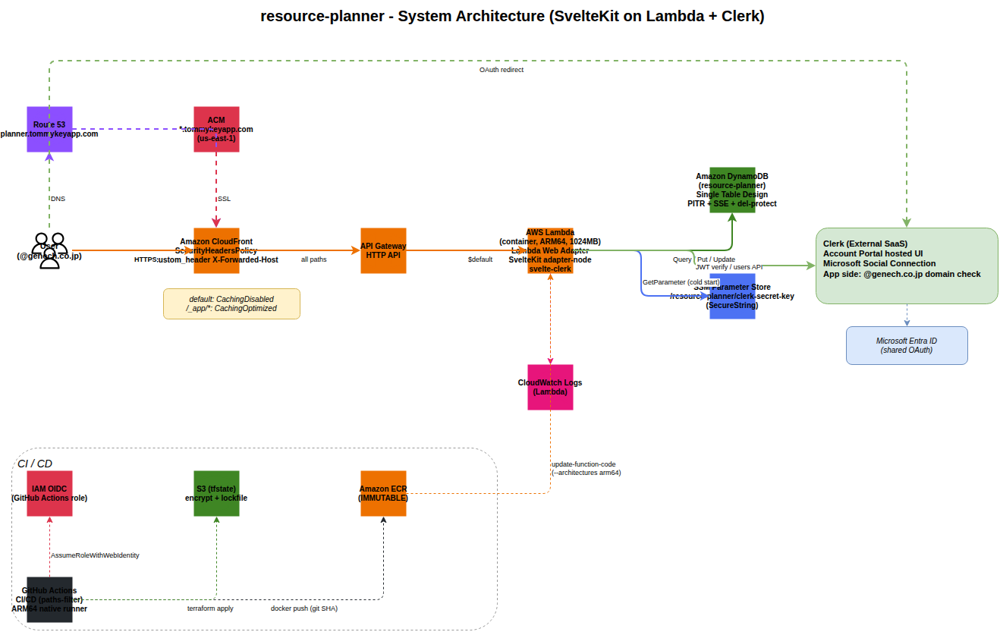

# resource-planner

要員計画アプリ — Svelte 5 + Tailwind v4 + `@tommykey-apps/ui-components` 消費。

## Tech Stack

| Layer | Tool | Version |
|---|---|---|
| Runtime | Node.js | 22 |
| Package Manager | pnpm | 10 |
| Framework | SvelteKit | 2.58 |
| UI | Svelte | 5.55+ |
| Bundler | Vite | 8 |
| Styling | Tailwind CSS | 4 |
| Component Library | [`@tommykey-apps/ui-components`](https://github.com/tommykey-apps/ui-components) (private) | 0.9.x |
| Adapter | `@sveltejs/adapter-node` | 5 |
| Auth | Auth.js + Email Magic Link | `@auth/sveltekit` 1.11+ |
| DB | DynamoDB (Single Table Design) | — |
| Hosting | Lambda (ARM64 container) + API Gateway HTTP API + CloudFront | — |
| Type Checking | TypeScript / svelte-check | 6 / 4 |
| Linter | ESLint + Prettier | 10 / 3 |
| Dev Env | flox | 1.11 |

## 開発環境

**flox を使う。** 手動で Node や pnpm をインストールしない。

```bash
flox activate
```

## 認証 (`@tommykey-apps/*` private packageを取得)

GitHub Packages から private package を取得するため、`GITHUB_TOKEN` 環境変数(`read:packages` スコープを持つ PAT)が必要:

```bash
export GITHUB_TOKEN=$(gh auth token)   # gh が tommykey0925 / tommykey-apps 配下にアクセス権を持つ場合
# または明示的に PAT を設定:
# export GITHUB_TOKEN=ghp_xxxxxxxxxxxxxxxxx
```

`.npmrc` で `${GITHUB_TOKEN}` を参照しているので、env が設定されていれば `pnpm install` 経由で透過的に解決される。

CI では `secrets.GITHUB_TOKEN` をそのまま使う(`.github/workflows/ci.yaml` 参照)。

## コマンド

ルート (`Makefile`):

```bash
make help          # 利用可能なコマンド一覧
make dev           # SvelteKit dev server (cd web && pnpm dev)
make build         # 本番ビルド (Lambda container 用)
make db            # DynamoDB Local 起動 + table 作成 (port 8000)
make db-docs       # tbls で docs/db/schema/ 再生成
make db-docs-diff  # スキーマ drift 確認
make clean         # docker compose down
```

`web/` 直接:

```bash
cd web
pnpm install               # 依存インストール (要 GITHUB_TOKEN)
pnpm dev                   # Vite dev server
pnpm build                 # ビルド (build/ に出力、Lambda 用)
pnpm check                 # svelte-check
pnpm format                # Prettier 自動修正
pnpm test                  # Vitest (unit; DDB Local 起動時は integration も含む)
pnpm test:watch            # Vitest watch mode
pnpm test:coverage         # Vitest + v8 coverage
```

### コード品質 audit

Claude Code セッションで `web/src/` を編集すると、 ターン終了時に `/audit` skill 実行が自動推奨される (`.claude/hooks/stop-audit-gate.sh` 経由)。 audit は `pnpm check` / `pnpm test` / `knip` (unused exports) / `jscpd` (重複コード) / `madge` (循環依存) を順次実行し、 大規模変更時は `code-reviewer` subagent も spawn する。 ローカルバイパス防止のため PR 時に CI でも同 audit を走らせる (`.github/workflows/audit.yaml`、 `continue-on-error` で warning レベル)。 詳細は [CLAUDE.md](CLAUDE.md#コード品質-audit-自動化-188) 参照。

### 統合テストの実行

`web/src/lib/repository/integration.test.ts` は `AWS_ENDPOINT_URL` が設定されている時のみ実行
([`describe.runIf`](https://vitest.dev/api/#describe-runif))。ローカルで integration まで含めて実行するには:

```bash
make db                    # DynamoDB Local 起動 + table 作成
cd web
AWS_ENDPOINT_URL=http://localhost:8000 \
AWS_ACCESS_KEY_ID=local AWS_SECRET_ACCESS_KEY=local AWS_DEFAULT_REGION=ap-northeast-1 \
DYNAMODB_TABLE=resource-planner \
pnpm test
```

CI では `.github/workflows/ci.yaml` の `test` job が `services.dynamodb` で起動して unit + integration を一括実行する。
詳細方針は [ADR 0007](docs/adr/0007-tdd-with-vitest-and-playwright.md) 参照。

## UI 構成

主要画面 (home `/` / assignments `/assignments`) は [`@tommykey-apps/ui-components`](https://github.com/tommykey-apps/ui-components) の `ResourceTimeline` + `TimelineToolbar` を組み合わせて構成する。 直近の version で取り込んだ機能:

| 機能 | 採用箇所 | 関連 ui-components issue |
|---|---|---|
| Cursor follow hover tooltip (旧: bar 中央 anchor で wide bar 時画面端に貼り付き) | `web/src/routes/+page.svelte` | #42 / #48 / #50 |
| Resource rail auto-fit (最長名 + chrome を Canvas measureText で実測、 `resourceColWidth="auto"`) | 同上 | #43 / #47 / #51 / #53 |
| i18n labels prop | 全 ResourceTimeline 利用箇所 | #33 |

ui-components 側の挙動と props 一覧は [tommykey-apps/ui-components README](https://github.com/tommykey-apps/ui-components#available-components) 参照。

## アーキテクチャ



> [docs/architecture.drawio](docs/architecture.drawio) を draw.io で開くと編集できる。
> 図を更新したら `drawio-png` skill (またはローカル draw.io GUI) で `docs/architecture.png` を再 export して commit する。

## 設計ドキュメントの読み方

本リポジトリは **型駆動 docs 戦略** を採用している ([ADR 0001](docs/adr/0001-typescript-types-as-api-spec.md))。
OpenAPI は使わず、TypeScript 型 + Zod schema を API 仕様の正本とし、自然言語ドキュメントは
役割を分けて 4 箇所に集約する。

**📖 公開 docs**: <https://tommykey-apps.github.io/resource-planner/>

| 何が知りたい | どこを見る | Pages |
|---|---|---|
| **構造** (どのコンポーネントがどう繋がっているか) | [`docs/architecture.drawio`](docs/architecture.drawio) ([PNG](docs/architecture.png)) — C4 Container 図 | [/architecture.png](https://tommykey-apps.github.io/resource-planner/architecture.png) |
| **なぜ** その判断をしたか | [`docs/adr/`](docs/adr/) — Architecture Decision Records (Michael Nygard 形式) | [/adr/](https://tommykey-apps.github.io/resource-planner/adr/) |
| **どう動く** か (画面 → action → DB の流れ) | [`docs/use-cases.md`](docs/use-cases.md) — Mermaid sequence diagrams | [/use-cases.html](https://tommykey-apps.github.io/resource-planner/use-cases.html) |
| **データモデル** (PK / SK / 属性 / クエリパターン) | [`docs/db/`](docs/db/) — tbls 自動生成 + 手書き entities/access-patterns | [/db/](https://tommykey-apps.github.io/resource-planner/db/) |
| **API 仕様** (関数の入出力) | TypeScript 型 (`web/src/lib/types.ts`, Zod schema) | (コード直読) |

### Architecture Decision Records

| # | タイトル | Status |
|---|---|---|
| [0001](docs/adr/0001-typescript-types-as-api-spec.md) | TypeScript 型を API 仕様の正本とする | Accepted |
| [0002](docs/adr/0002-id-generation-with-ulid.md) | ID 生成戦略を ULID に統一する | Accepted |
| [0003](docs/adr/0003-end-date-inclusive-storage.md) | endDate は inclusive で保存する | Superseded by 0004 |
| [0004](docs/adr/0004-end-date-exclusive-with-form-transform.md) | endDate は exclusive 半開区間 + Zod transform | Accepted |
| [0005](docs/adr/0005-assignment-drag-resize-transport.md) | Assignment ドラッグ / リサイズは `+server.ts` API + Optimistic UI | Accepted |
| [0006](docs/adr/0006-cascade-delete-strategy.md) | Resource / Project の削除は cascade (TransactWriteItems) | Accepted |
| [0007](docs/adr/0007-tdd-with-vitest-and-playwright.md) | TDD で開発する: Vitest + Playwright | Accepted |
| [0008](docs/adr/0008-auth-migration-clerk-to-authjs.md) | 認証を Clerk → Auth.js + Email Magic Link に移行する | Accepted |
| [0009](docs/adr/0009-org-to-team-redesign.md) | マルチテナント単位を Clerk Org → 自前 Team モデルに再設計する | Accepted |

### Use Cases

| UC | タイトル | 実装 |
|---|---|---|
| [UC-01](docs/use-cases.md#uc-01-リソース-人-を追加編集削除する) | リソース (人) を追加・編集・削除する | PR-C |
| [UC-02](docs/use-cases.md#uc-02-案件-project-を追加編集削除する) | 案件 (Project) を追加・編集・削除する | PR-D |
| [UC-03](docs/use-cases.md#uc-03-アサインを作成する) | アサインを作成する | PR-E |
| [UC-04](docs/use-cases.md#uc-04-アサインの期間を変更する-ドラッグ--リサイズ) | アサインの期間を変更する (ドラッグ / リサイズ) | PR-F |
| [UC-05](docs/use-cases.md#uc-05-アサインを削除する) | アサインを削除する | PR-G |
| [UC-06](docs/use-cases.md#uc-06-人--案件を削除する-cascade) | 人 / 案件を削除する (cascade) | PR-H |

新機能を追加するときは [`.github/ISSUE_TEMPLATE/feature.yml`](.github/ISSUE_TEMPLATE/feature.yml) を使う。
ADR / use-case / 型定義の追加が AC に含まれる。

## 本番投入手順 (Auth.js infra、PR-A4)

`infra/` を `terraform apply` した後、以下を **手動で 1 度だけ** 実行する:

```bash
# 1. AUTH_SECRET を生成して SSM SecureString に投入 (terraform state には残さない)
SECRET=$(openssl rand -hex 32)
aws ssm put-parameter \
  --name /resource-planner/auth-secret \
  --value "$SECRET" \
  --type SecureString \
  --overwrite \
  --region ap-northeast-1

# 2. SES domain identity の verified 状態を確認 (DKIM CNAME 反映に最大 15 分)
aws sesv2 get-email-identity \
  --email-identity tommykeyapp.com \
  --region ap-northeast-1
# VerifiedForSendingStatus が true、DkimAttributes.Status が SUCCESS ならOK

# 3. SES Sandbox 解除を申請 (本番ユーザーへの送信を有効化、24-48 時間)
# AWS Console → SES → Account dashboard → Request production access
# `ALLOWED_DOMAIN` 配下の社内ユーザーのみに送信する旨を理由に記載
```

その後 `gh secret set` で CD 用の env を本番用に揃える (`AUTH_SECRET` は SSM 経由で Lambda 起動時に取得するため、CD には不要)。

## 関連リポジトリ

- [tommykey-apps/ui-components](https://github.com/tommykey-apps/ui-components) — Svelte コンポーネントライブラリ
