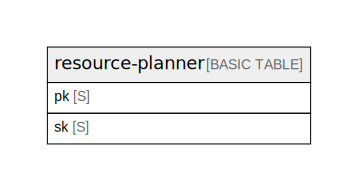

# Amazon DynamoDB (ap-northeast-1)

## Tables

| Name                                    | Attributes | Comment                                                                                                                                                                                                                                                                                                                                          | Type        |
| --------------------------------------- | ---------- | ------------------------------------------------------------------------------------------------------------------------------------------------------------------------------------------------------------------------------------------------------------------------------------------------------------------------------------------------ | ----------- |
| [resource-planner](resource-planner.md) | 4          | Single Table Design for resource planning. pk: ORG#{clerk_org_id} - Multi-tenant isolation by Clerk organization. sk: Entity prefix (RES#, PRJ#, ASN#) + entity-specific key. Entities: Resource (people), Project (clients), Assignment (time allocations). See ../entities.md and ../access-patterns.md for details.  | BASIC TABLE |

## Relations

---

> Generated by [tbls](https://github.com/k1LoW/tbls)
