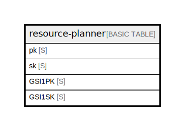

# resource-planner

## Description

Single Table Design for resource planning.  
pk varies by entity scope:  
  - TEAM#{teamId}    - App entities (Resource / Project / Assignment / Team / Membership)  
  - USER#{userId}    - Auth.js User / Account (managed by @auth/dynamodb-adapter)  
  - SESSION#{token}  - Auth.js Session (TTL: expires)  
  - VERIFICATION#{token} - Auth.js Magic Link verification token (TTL: expires)  
Initial deployment uses default team "team_default"; multi-team support is wired but unused.  
See ../entities.md and ../access-patterns.md, ADR 0008 / 0009 for history.  

## Attributes

| Name   | Type | Default | Nullable | Children | Parents | Comment                                                                                                                                                                                                                                                                                                                                                                                                                                                                                                              |
| ------ | ---- | ------- | -------- | -------- | ------- | -------------------------------------------------------------------------------------------------------------------------------------------------------------------------------------------------------------------------------------------------------------------------------------------------------------------------------------------------------------------------------------------------------------------------------------------------------------------------------------------------------------------- |
| pk     | S    |         | false    |          |         | Partition key. Format varies by entity: - TEAM#{teamId}        for app data (Resource / Project / Assignment / Team / Membership) - USER#{userId}        for Auth.js User / Account records - SESSION#{token}      for Auth.js Session records - VERIFICATION#{token} for Auth.js Magic Link verification tokens                                                                                                                                                                            |
| sk     | S    |         | false    |          |         | Sort key. Format varies by entity type: - META                                  for Team / User / Session / Verification meta records - MEMBER#{userId}                       for Team membership - RES#{resource_id}                     for resources (people) - PRJ#{project_id}                      for projects (clients) - ASN#{start_date}#{assignment_id}      for assignments - ACCOUNT#{provider}#{providerAccountId} for Auth.js Account (per-provider link to User)  |
| GSI1PK | S    |         | false    |          |         |                                                                                                                                                                                                                                                                                                                                                                                                                                                                                                                      |
| GSI1SK | S    |         | false    |          |         |                                                                                                                                                                                                                                                                                                                                                                                                                                                                                                                      |

## Primary Key

| Name        | Type                       | Definition                                                                           |
| ----------- | -------------------------- | ------------------------------------------------------------------------------------ |
| Primary Key | Partition key and sort key | [{ AttributeName: "pk", KeyType: "HASH" } { AttributeName: "sk", KeyType: "RANGE" }] |

## Secondary Indexes

| Name | Definition                                                                                                                                       |
| ---- | ------------------------------------------------------------------------------------------------------------------------------------------------ |
| GSI1 | GlobalSecondaryIndex { [{ AttributeName: "GSI1PK", KeyType: "HASH" } { AttributeName: "GSI1SK", KeyType: "RANGE" }], { ProjectionType: "ALL" } } |

## Relations

---

> Generated by [tbls](https://github.com/k1LoW/tbls)
