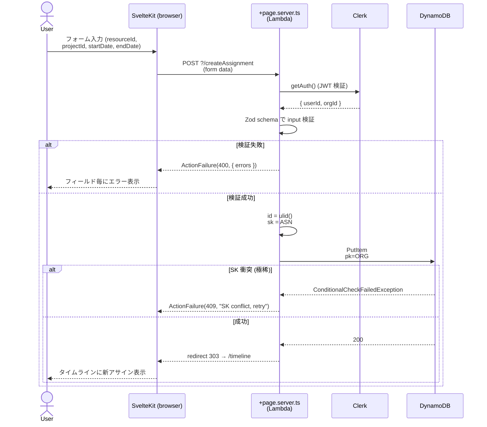

# Use Cases

resource-planner の主要ユースケースを **Mermaid sequence diagram** で記述する。
SvelteKit form actions / `+page.server.ts` load の動的振る舞い (画面 → action → DB → redirect/render) を「設計仕様」として残す場所。

## 書き方

各ユースケースは:

1. **見出し**: `## UC-NN: 短い動詞句` (例: `## UC-01: アサインを作成する`)
2. **概要**: 1-2 文
3. **アクター / 前提条件**: 誰が / どんな状態で発火するか
4. **対応コード**: 該当する `+page.server.ts` / form action / load 関数へのリンク (実装後に追記)
5. **Mermaid sequence**: 動作フロー
6. **エラーケース**: 失敗パスを箇条書き

## 一覧

| # | Use case | 状態 |
|---|---|---|
| UC-01 | [アサインを作成する](#uc-01-アサインを作成する) | サンプル (CRUD 未実装) |

> **Note**: 実機能 (Resource / Project / Assignment の CRUD) はまだ未実装のため、現時点のユースケースは設計仕様としてのサンプル 1 件のみ。
> 実装 issue が起票されるたびに、その AC で本ファイルにユースケースを追記する運用とする ([#31](https://github.com/tommykey-apps/resource-planner/issues/31), [`docs/adr/0001-typescript-types-as-api-spec.md`](adr/0001-typescript-types-as-api-spec.md) 参照)。

---

## UC-01: アサインを作成する

### 概要

リソース (人) を案件 (Project) に期間 (startDate 〜 endDate) でアサインする。タイムライン UI から開始。

### アクター / 前提条件

- アクター: 認証済みユーザー (`@your-company.example.com` ドメイン制限を通過)
- 前提条件:
  - サインイン済 (Clerk session 有効)
  - 対象 Resource と Project が同じ組織内に存在
  - startDate ≤ endDate (実装側で検証)

### 対応コード (実装後に追記)

- 画面: `web/src/routes/timeline/+page.svelte` (TODO)
- Action: `web/src/routes/timeline/+page.server.ts` の `actions.createAssignment` (TODO)
- 検証 schema: `web/src/lib/schemas/assignment.ts` (Zod、TODO)
- DB アクセス: `web/src/lib/db/assignment.ts` (TODO)

### Mermaid sequence



### エラーケース

- 未認証: Clerk の `+layout.server.ts` で `redirect(303, "/sign-in")` (本 sequence の前段で処理済)
- クロステナント: PK は **常に server-side で session の orgId から組み立てる** (HTTP body の orgId は信用しない)。詳細は [`db/access-patterns.md` の A1](db/access-patterns.md#a1-クロステナント混入防止) 参照
- リソース / 案件不存在: FK 制約は DDB に無いため、app 層で先に `GetItem` で存在確認するか、整合性破壊を許容するかは実装時に判断 (UC レベルでは未定)

---

## ユースケース追加のテンプレ

新規ユースケース追加時のコピペ用:

```markdown
## UC-NN: <短い動詞句>

### 概要
1-2 文。

### アクター / 前提条件
- アクター:
- 前提条件:

### 対応コード
- 画面:
- Action / Loader:
- 検証 schema:
- DB アクセス:

### Mermaid sequence
\`\`\`mermaid
sequenceDiagram
    actor User
    participant SK as SvelteKit (browser)
    participant Server
    participant DDB as DynamoDB
    User->>SK: ...
    SK->>Server: ...
\`\`\`

### エラーケース
- ...
```
