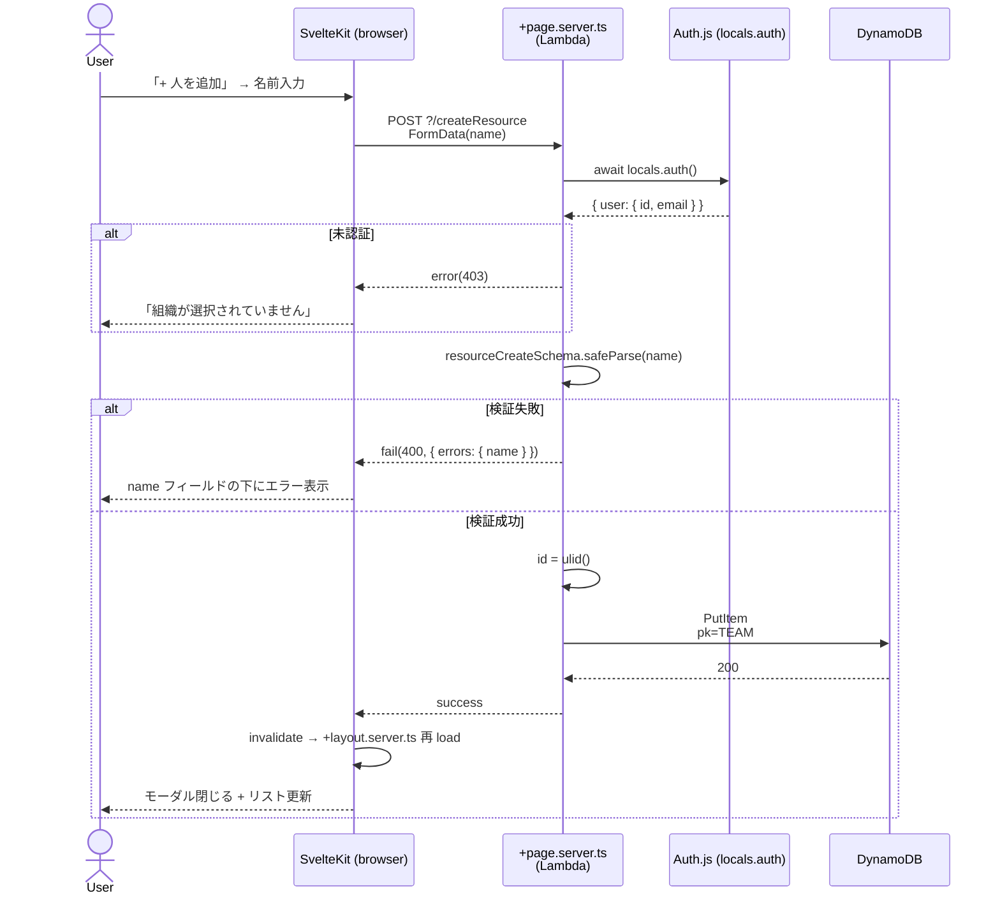
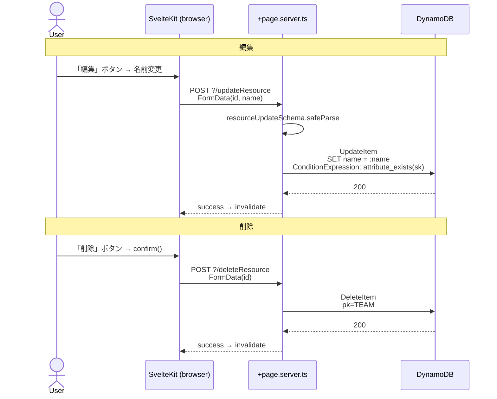
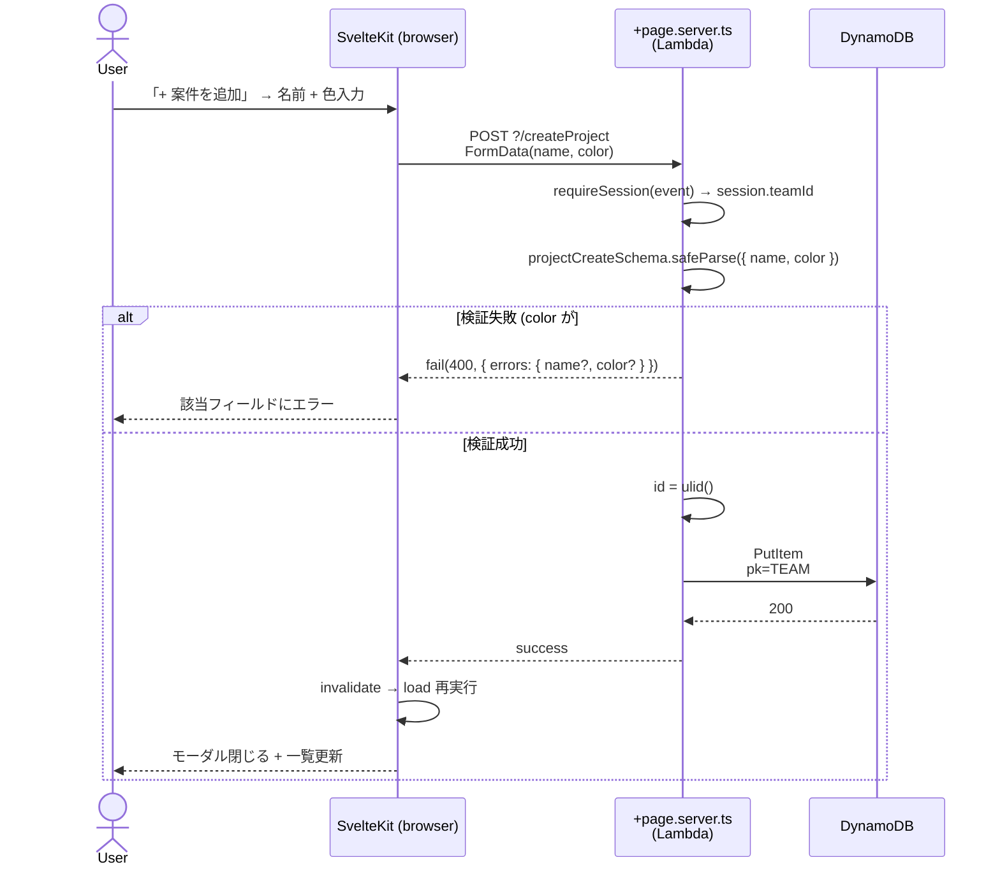
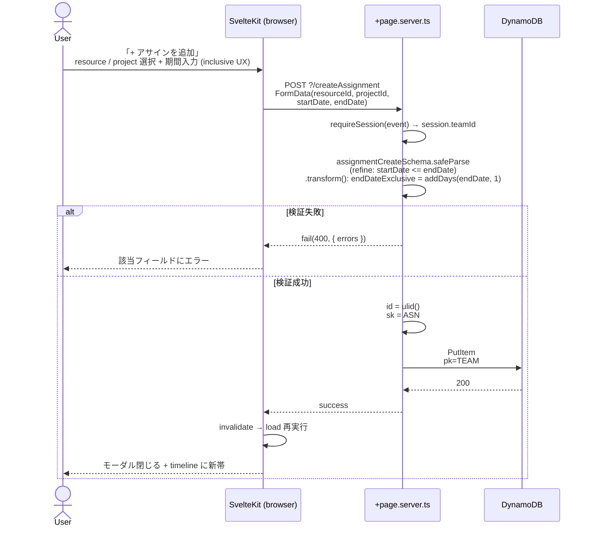
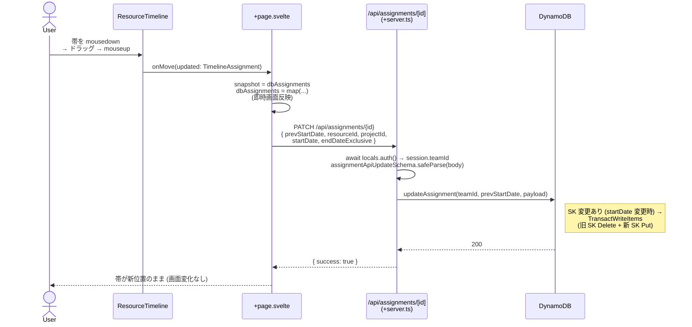
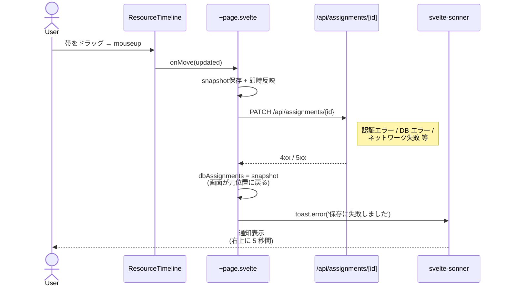
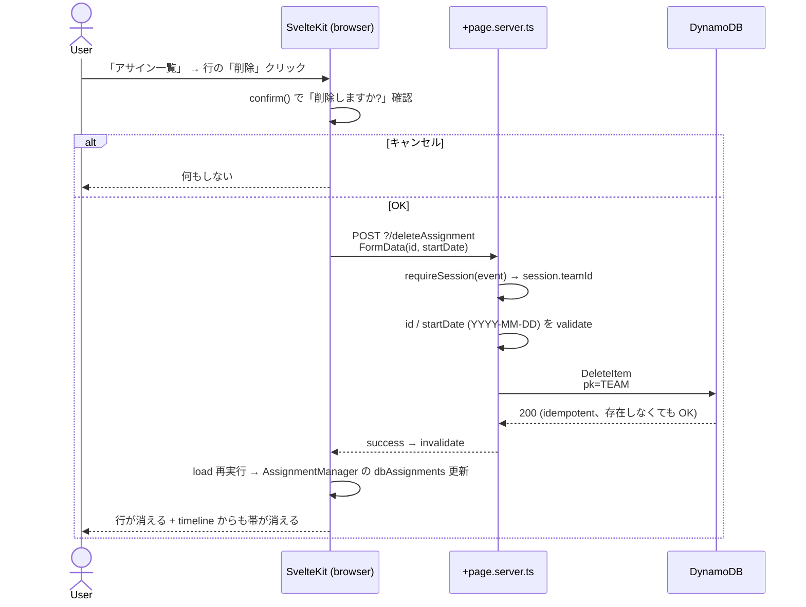
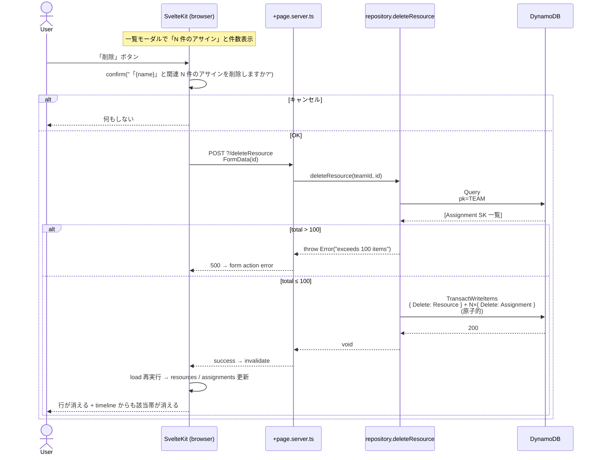

# Use Cases

resource-planner の主要ユースケースを **Mermaid sequence diagram** で記述する。
SvelteKit form actions / `+page.server.ts` load の動的振る舞い (画面 → action → DB → redirect/render) を「設計仕様」として残す場所。

## 書き方

各ユースケースは:

1. **見出し**: `## UC-NN: 短い動詞句` (例: `## UC-01: アサインを作成する`)
2. **概要**: 1-2 文
3. **アクター / 前提条件**: 誰が / どんな状態で発火するか
4. **対応コード**: 該当する `+page.server.ts` / form action / load 関数へのリンク (実装後に追記)
5. **Mermaid sequence**: 動作フロー
6. **エラーケース**: 失敗パスを箇条書き

## 一覧

| # | Use case | 状態 |
|---|---|---|
| UC-01 | [リソース (人) を追加・編集・削除する](#uc-01-リソース-人-を追加編集削除する) | 実装済 (PR-C) |
| UC-02 | [案件 (Project) を追加・編集・削除する](#uc-02-案件-project-を追加編集削除する) | 実装済 (PR-D) |
| UC-03 | [アサインを作成する](#uc-03-アサインを作成する) | 実装済 (PR-E) |
| UC-04 | [アサインの期間を変更する (ドラッグ / リサイズ)](#uc-04-アサインの期間を変更する-ドラッグ--リサイズ) | 実装済 (PR-F) |
| UC-05 | [アサインを削除する](#uc-05-アサインを削除する) | 実装済 (PR-G) |
| UC-06 | [人 / 案件を削除する (cascade)](#uc-06-人--案件を削除する-cascade) | 実装済 (PR-H) |

> CRUD 実装の進捗に応じて UC を追記する運用 ([#31](https://github.com/tommykey-apps/resource-planner/issues/31), [`docs/adr/0001-typescript-types-as-api-spec.md`](adr/0001-typescript-types-as-api-spec.md) 参照)。

---

## UC-01: リソース (人) を追加・編集・削除する

### 概要

組織内のメンバー (Resource) を管理する。タイムラインの行に対応する人を CRUD する。

### アクター / 前提条件

- アクター: 認証済みユーザー (許可ドメイン制限を通過、team_default に自動 join)
- 前提条件:
  - サインイン済 (Auth.js session 有効、`session.teamId` 存在)
  - 「人を管理」モーダルから操作

### 対応コード

- 画面: [`web/src/routes/+page.svelte`](../web/src/routes/+page.svelte) (`<ResourceManager />` 配置)
- UI コンポーネント: [`web/src/lib/components/ResourceManager.svelte`](../web/src/lib/components/ResourceManager.svelte)
- Form actions: [`web/src/routes/+page.server.ts`](../web/src/routes/+page.server.ts) の `actions.createResource` / `updateResource` / `deleteResource`
- 検証 schema: [`web/src/lib/schemas/index.ts`](../web/src/lib/schemas/index.ts) の `resourceCreateSchema` / `resourceUpdateSchema`
- DB アクセス: [`web/src/lib/repository/resource.ts`](../web/src/lib/repository/resource.ts)

### Mermaid sequence (作成フロー)



### Mermaid sequence (編集 / 削除フロー)



### エラーケース

- **未認証**: `requireSession(event)` が `error(401|403)` で SvelteKit の `+error.svelte` に誘導 (UI polish は Orphan PR)
- **入力検証失敗**: `name` 未入力 / 100 文字超 → `fail(400, { errors })` で UI に表示、モーダル閉じない
- **DB 楽観的衝突**: ULID は実質衝突しないが、`attribute_not_exists(sk)` ConditionExpression が万一の二重 put を防ぐ
- **削除時の関連 Assignment**: 現状は **orphan として残る** (cascade delete は PR-H 予定)。UI の confirm ダイアログでその旨を注記

### 既知の制約 (PR-C 時点)

- 並べ替え / 一括選択 UI なし
- 検索フィルタなし
- delete は orphan を作る (PR-H で TransactWriteItems による cascade に置き換え予定)

---

## UC-02: 案件 (Project) を追加・編集・削除する

### 概要

案件 (タイムラインで帯の **色とラベル** に対応する Project) を組織内で管理する。
帯の表示色をユーザーが選べるようにする。

### アクター / 前提条件

- アクター: 認証済みユーザー (team_default に自動 join)
- 前提条件:
  - サインイン済 + `session.teamId` 存在
  - 「案件を管理」モーダルから操作

### 対応コード

- 画面: [`web/src/routes/+page.svelte`](../web/src/routes/+page.svelte) (`<ProjectManager />` 配置)
- UI コンポーネント: [`web/src/lib/components/ProjectManager.svelte`](../web/src/lib/components/ProjectManager.svelte)
- Form actions: [`web/src/routes/+page.server.ts`](../web/src/routes/+page.server.ts) の `actions.createProject` / `updateProject` / `deleteProject`
- 検証 schema: [`web/src/lib/schemas/index.ts`](../web/src/lib/schemas/index.ts) の `projectCreateSchema` / `projectUpdateSchema`
- DB アクセス: [`web/src/lib/repository/project.ts`](../web/src/lib/repository/project.ts)

### Mermaid sequence (作成フロー)



### Mermaid sequence (編集 / 削除)

UC-01 と同形 (UpdateItem / DeleteItem)。差分は更新対象が `name` + `color` の 2 フィールドである点のみ。
詳細は [UC-01 の編集 / 削除フロー](#mermaid-sequence-編集--削除フロー) を参照。

### エラーケース

- 未認証: UC-01 と同じ (`requireSession` で 401)
- 入力検証失敗:
  - `name` 未入力 / 100 文字超 → `errors.name`
  - `color` が `#RRGGBB` 形式でない → `errors.color` (`<input type="color">` を使うので通常起きない)
- 削除時の関連 Assignment: 現状は orphan 残留 (PR-H で cascade)

### 既知の制約 (PR-D 時点)

- 色のプリセットパレットなし (ネイティブ `<input type="color">` のみ)
- 並べ替えなし
- delete は orphan (PR-H で改善)

---

## UC-03: アサインを作成する

### 概要

人 (Resource) を案件 (Project) に **期間 `[startDate, endDateExclusive)` の半開区間** でアサインする。
タイムラインに帯として表示される。フォーム UX は inclusive (「終了日 5/31」と入力)、内部は exclusive ([ADR 0004](adr/0004-end-date-exclusive-with-form-transform.md))。

### アクター / 前提条件

- アクター: 認証済みユーザー (team_default に自動 join)
- 前提条件:
  - 組織内に Resource ≥ 1、Project ≥ 1 (両方必要)
  - 「+ アサインを追加」ボタンから操作 (条件未達なら disable)

### 対応コード

- 画面: [`web/src/routes/+page.svelte`](../web/src/routes/+page.svelte) (`<AssignmentCreator />` 配置)
- UI コンポーネント: [`web/src/lib/components/AssignmentCreator.svelte`](../web/src/lib/components/AssignmentCreator.svelte)
- Form action: [`web/src/routes/+page.server.ts`](../web/src/routes/+page.server.ts) の `actions.createAssignment`
- 検証 schema: [`web/src/lib/schemas/index.ts`](../web/src/lib/schemas/index.ts) の `assignmentCreateSchema` (`refine` で `startDate <= endDate`、`.transform()` で `endDateExclusive = addDays(endDate, 1)`)
- DB アクセス: [`web/src/lib/repository/assignment.ts`](../web/src/lib/repository/assignment.ts)

### Mermaid sequence



### endDate の取り扱い (ADR 0004)

業界標準 (RFC 5545 / Google Calendar / PostgreSQL daterange / Java / Rust / Python / Bryntum) と整合する **「内部 exclusive 半開区間 + フォーム inclusive UX + Zod transform で 1 箇所変換」** 構成:

- **フォーム入力**: ユーザーは「終了日 (含む) 5/31」と入力 (UX inclusive)
- **Zod `.transform()`**: `endDateExclusive = addDays(input.endDate, 1)` で `2026-06-01` に変換 (**唯一の `+1` 変換場所**)
- **DB / API / Repository / Type**: `endDateExclusive: "2026-06-01"` で統一
- **ResourceTimeline 渡し**: 規約一致 (両者 exclusive) のため adapter は型変換のみ、`±1 day` 不要
- **帯のラベルと色**: `Project.name` / `Project.color` から compose (Resource のみ knows、Project は app 層で結合)

### エラーケース

- **未認証**: `requireSession(event)` が `error(401|403)`
- **resourceId / projectId が空 or 不正**: `errors.resourceId` / `errors.projectId` を表示
- **startDate > endDate**: Zod `refine` が「終了日は開始日以降にしてください」を返す (transform 前の inclusive 比較)
- **resource / project が同時刻に削除されていた**: FK 制約は無いため Put は成功する。タイムライン表示時に projectId が見つからず帯のラベル / 色がフォールバックする (UI で警告は出さない、PR-H で削除フローを cascade 化したらこのケースも消える)
- **SK 衝突**: ULID 衝突は実質ゼロ。`attribute_not_exists(sk)` ConditionExpression が万一のときに防御

### 既知の制約 (PR-E 時点)

- ResourceTimeline のセルクリック / 範囲ドラッグでの作成は未対応 (ライブラリ側の API 不在)。「+ アサインを追加」ボタン経由のフォーム入力のみ
- アサイン編集は未実装 (PR-F でドラッグ移動 / リサイズ、PR-G で削除)
- 重複期間チェックなし (1 人が同期間に複数案件にアサインされるのを許容)

---

## UC-04: アサインの期間を変更する (ドラッグ / リサイズ)

### 概要

タイムライン上の帯をドラッグして移動 (= 開始日 / リソース変更) またはエッジをドラッグしてリサイズ (= 終了日変更) すると、DB に永続化される。Optimistic UI (即時反映 + 失敗で revert) で応答性を優先。

### アクター / 前提条件

- アクター: 認証済みユーザー (team_default に自動 join)
- 前提条件:
  - 既に 1 件以上のアサインがタイムラインに存在 (UC-03 で作成)
  - マウス / タッチデバイス (ドラッグ操作可能)

### 対応コード

- 画面: [`web/src/routes/+page.svelte`](../web/src/routes/+page.svelte) の `handleUpdate` (`onMove` / `onResize` から呼ばれる)
- API endpoint: [`web/src/routes/api/assignments/[id]/+server.ts`](../web/src/routes/api/assignments/[id]/+server.ts) (PATCH)
- 検証 schema: [`web/src/lib/schemas/index.ts`](../web/src/lib/schemas/index.ts) の `assignmentApiUpdateSchema` (transform なし、ADR 0005)
- DB アクセス: [`web/src/lib/repository/assignment.ts`](../web/src/lib/repository/assignment.ts) の `updateAssignment` (SK 変更時は TransactWriteItems で旧 Delete + 新 Put)
- トースト: [`svelte-sonner`](https://github.com/wobsoriano/svelte-sonner)、`<Toaster />` を [`+layout.svelte`](../web/src/routes/+layout.svelte) に配置

### Mermaid sequence (成功フロー)



### Mermaid sequence (失敗フロー: revert)



### 設計判断 (ADR 0005)

- **Form action ではなく `+server.ts`**: drag/resize は画面遷移を伴わない細粒度操作で JSON body が自然
- **Optimistic UI + 失敗時 revert**: ドラッグの応答性最優先、Google Calendar と同じパターン
- **Last-write-wins (楽観ロック未実装)**: 100 ユーザー規模で衝突は稀、必要になったら version 列導入を別 ADR で
- **`assignmentApiUpdateSchema` は transform なし**: API は app 内部 RPC、`endDateExclusive` を直接受け取る (ADR 0004 の「変換はフォーム境界の 1 箇所」原則と整合)

### endDate の取り扱い

- ResourceTimeline の `onMove` / `onResize` が返す `TimelineAssignment.endDate` は **Date オブジェクト、exclusive** (規約一致、ADR 0004)
- `fromTimelineAssignment(updated, prev)` で `Date → YYYY-MM-DD` 文字列化、`±1 day` 不要
- API body は `endDateExclusive` (DB 形と同じ)
- Repository は `AssignmentUpdatePayload` 互換を受け取り、DB attr `endDateExclusive` で書き込み

### エラーケース

- **未認証**: API が 401 / 403 → 画面 revert + toast「保存に失敗しました」
- **アサインが他で削除されていた**: `updateAssignment` の `ConditionExpression: attribute_exists(sk)` 違反で `TransactionCanceledException` → 500 → revert + toast
- **SK 衝突 (同 startDate 同 id)**: ULID 衝突は実質ゼロ、`attribute_not_exists(sk)` で防御。発生したら 500 → revert
- **ネットワーク失敗 / タイムアウト**: fetch reject → revert + toast
- **同時編集 (last-write-wins)**: 別ユーザーが同じ Assignment を後から保存したら上書き。本実装では検知しない (将来 ADR で楽観ロック導入の余地)

### 既知の制約 (PR-F 時点)

- 楽観ロックなし (last-write-wins)
- ドラッグ中の visual feedback はライブラリ任せ (custom hover/preview UI なし)
- 「Resize で startDate も同時に変える」「他リソース行へ drop で resourceId 変更」 等の挙動は ResourceTimeline ライブラリの実装に依存

---

## UC-05: アサインを削除する

### 概要

「アサイン一覧」モーダルから個別のアサインを削除する。SK が `ASN#{startDate}#{id}` で構成されるため、フォームから `id` と `startDate` の両方を渡す。

### アクター / 前提条件

- アクター: 認証済みユーザー (team_default に自動 join)
- 前提条件:
  - 削除対象のアサインが存在する
  - 「アサイン一覧」モーダルから操作

### 対応コード

- 画面: [`web/src/routes/+page.svelte`](../web/src/routes/+page.svelte) (`<AssignmentManager />` 配置)
- UI コンポーネント: [`web/src/lib/components/AssignmentManager.svelte`](../web/src/lib/components/AssignmentManager.svelte)
- Form action: [`web/src/routes/+page.server.ts`](../web/src/routes/+page.server.ts) の `actions.deleteAssignment`
- DB アクセス: [`web/src/lib/repository/assignment.ts`](../web/src/lib/repository/assignment.ts) の `deleteAssignment(teamId, startDate, id)`

### Mermaid sequence



### 設計判断

- **Form action 採用** (`+server.ts` API ではない): UC-04 (drag/resize) は API 採用したが、本 UC は一覧 UI からのクリック削除のため form action + `use:enhance` のほうが自然 (Resource / Project の delete と同じパターン)
- **`startDate` を hidden input で送る**: SK が `ASN#{startDate}#{id}` 構成のため必要。ULID だけでは SK 再構築できない
- **`confirm()` で警告**: ブラウザネイティブで MVP として十分。将来 cascade UI に置き換える可能性 (PR-H で Resource/Project cascade、本 UC では Assignment 単体削除)
- **idempotent**: DeleteItem は item 不在でもエラーにならない。Resource/Project が先に削除されて orphan になっていた Assignment も問題なく削除可能

### エラーケース

- **未認証**: `requireSession(event)` が `error(401|403)`
- **id / startDate が空 or 不正**: `fail(400, { errors })` で UI に表示 (通常は hidden input なので発生しない)
- **既に削除済**: DeleteItem は idempotent → 200。invalidate で正しい状態に追従

### 既知の制約 (PR-G 時点)

- Optimistic UI なし (form action + invalidate なのでサーバー応答後に画面更新)。UX 上は数 100ms の待ちあり、ドラッグほどの応答性は不要
- 一括選択 / bulk delete なし (1 件ずつ)
- timeline 上の帯から直接削除する UI なし (ライブラリ側のクリック / contextmenu callback 不在のため)

---

## UC-06: 人 / 案件を削除する (cascade)

### 概要

Resource (人) または Project (案件) を削除すると、関連する Assignment も **原子的に同時削除** される (ADR 0006)。
ResourceManager / ProjectManager に「N 件のアサイン」と関連件数を表示、削除確認ダイアログでも件数を明示。

### アクター / 前提条件

- アクター: 認証済みユーザー (team_default に自動 join)
- 前提条件:
  - 削除対象の Resource / Project が存在
  - 関連 Assignment 数が **100 件以下** (TransactWriteItems の上限)。100 件超は throw (ADR 0006 参照)

### 対応コード

- 画面: [`web/src/routes/+page.svelte`](../web/src/routes/+page.svelte) (`<ResourceManager />` / `<ProjectManager />` 配置)
- UI コンポーネント: [`ResourceManager.svelte`](../web/src/lib/components/ResourceManager.svelte) / [`ProjectManager.svelte`](../web/src/lib/components/ProjectManager.svelte)
- Form actions: [`+page.server.ts`](../web/src/routes/+page.server.ts) の `actions.deleteResource` / `deleteProject` (シグネチャ変更なし、内部実装が cascade 化)
- DB アクセス: [`repository/resource.ts`](../web/src/lib/repository/resource.ts) / [`repository/project.ts`](../web/src/lib/repository/project.ts) の `deleteResource` / `deleteProject`

### Mermaid sequence (Resource 削除)



Project 削除も同形 (FilterExpression が `projectId == id` に変わるだけ)。

### 設計判断 (ADR 0006)

- **TransactWriteItems で原子的削除**: 中途半端な状態を作らない、業界の DDB ベストプラクティス
- **件数を UI に出す**: 削除前にユーザーが影響範囲を理解できる、誤操作減少
- **100 件超は throw (フォールバックなし)**: YAGNI、社内 100 ユーザー / 月単位アサインで非現実的
- **削除動作を cascade に統一** (Resource 単体削除モードなし): 「孤立 Assignment を残す」ユースケースが無い

### エラーケース

- **未認証**: `requireSession(event)` が `error(401|403)`
- **100 件超**: repository が `Error('cascade delete exceeds 100 items')` を throw → form action は 500 返却。ユーザーには「削除に失敗しました」が出る (UI polish は Orphan PR の `+error.svelte` で改善予定)
- **TransactWriteItems の途中失敗**: ConditionCheck 不使用なので通常は失敗しない (network / IAM 起因のみ)。失敗時は何も削除されない (atomicity 保証)
- **削除中に他ユーザーが Assignment 追加**: 新 Assignment は orphan 化。実害低、社内ユーザー少規模なら稀

### 既知の制約 (PR-H 時点)

- 100 件超で throw、フォールバックなし (ADR 0006 で議論済)
- 取り消し (undo) 不可、確認モーダル通過後は復元できない
- 削除と同時に他ユーザーが Assignment 追加 → orphan 化 (実害低)
- バックグラウンド job ではなく synchronous: 100 件削除で数秒待つ可能性 (TransactWriteItems の通常応答時間)

---

## ユースケース追加のテンプレ

新規ユースケース追加時のコピペ用:

```markdown
## UC-NN: <短い動詞句>

### 概要
1-2 文。

### アクター / 前提条件
- アクター:
- 前提条件:

### 対応コード
- 画面:
- Action / Loader:
- 検証 schema:
- DB アクセス:

### Mermaid sequence
\`\`\`mermaid
sequenceDiagram
    actor User
    participant SK as SvelteKit (browser)
    participant Server
    participant DDB as DynamoDB
    User->>SK: ...
    SK->>Server: ...
\`\`\`

### エラーケース
- ...
```
