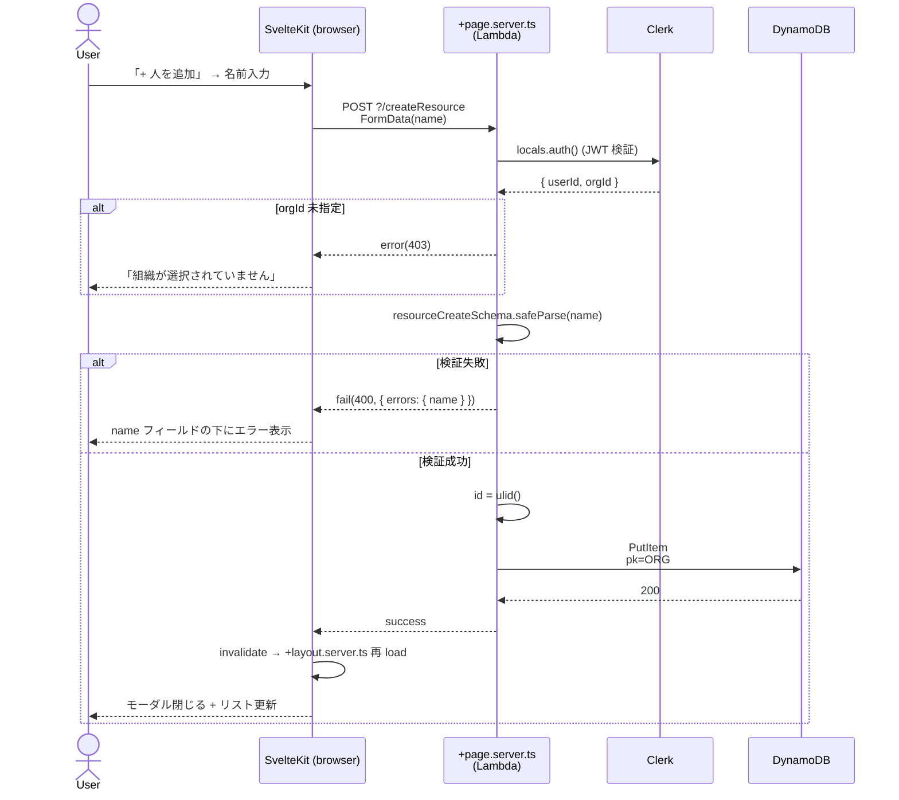
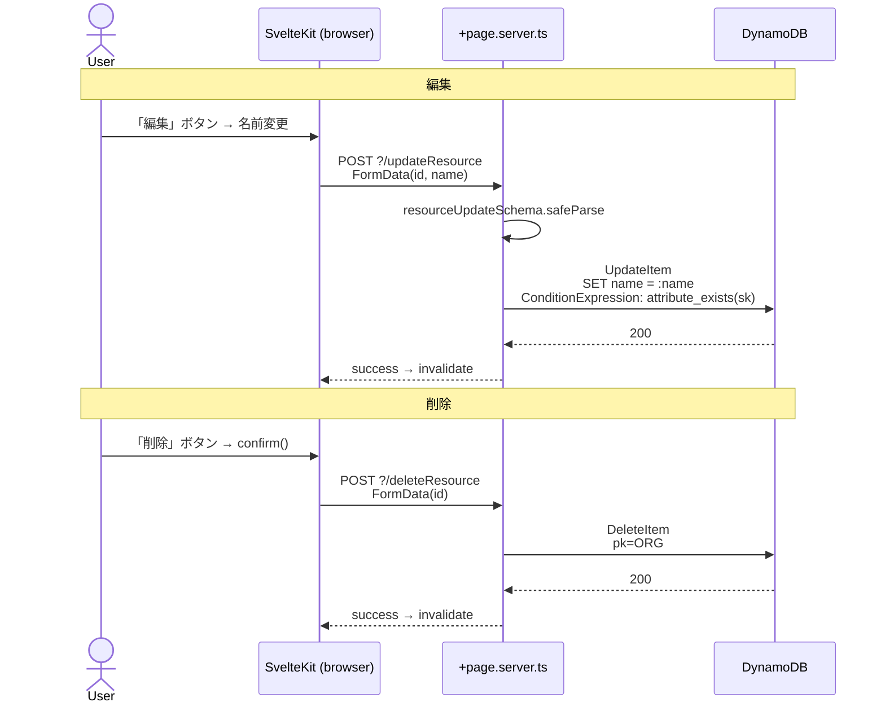

# Use Cases

resource-planner の主要ユースケースを **Mermaid sequence diagram** で記述する。
SvelteKit form actions / `+page.server.ts` load の動的振る舞い (画面 → action → DB → redirect/render) を「設計仕様」として残す場所。

## 書き方

各ユースケースは:

1. **見出し**: `## UC-NN: 短い動詞句` (例: `## UC-01: アサインを作成する`)
2. **概要**: 1-2 文
3. **アクター / 前提条件**: 誰が / どんな状態で発火するか
4. **対応コード**: 該当する `+page.server.ts` / form action / load 関数へのリンク (実装後に追記)
5. **Mermaid sequence**: 動作フロー
6. **エラーケース**: 失敗パスを箇条書き

## 一覧

| # | Use case | 状態 |
|---|---|---|
| UC-01 | [リソース (人) を追加・編集・削除する](#uc-01-リソース-人-を追加編集削除する) | 実装済 (PR-C) |

> CRUD 実装の進捗に応じて UC を追記する運用 ([#31](https://github.com/tommykey-apps/resource-planner/issues/31), [`docs/adr/0001-typescript-types-as-api-spec.md`](adr/0001-typescript-types-as-api-spec.md) 参照)。

---

## UC-01: リソース (人) を追加・編集・削除する

### 概要

組織内のメンバー (Resource) を管理する。タイムラインの行に対応する人を CRUD する。

### アクター / 前提条件

- アクター: 認証済みユーザー (`@your-company.example.com` ドメイン制限を通過、Clerk Org 必須 ON)
- 前提条件:
  - サインイン済 (Clerk session 有効、`event.locals.auth().orgId` 存在)
  - 「人を管理」モーダルから操作

### 対応コード

- 画面: [`web/src/routes/+page.svelte`](../web/src/routes/+page.svelte) (`<ResourceManager />` 配置)
- UI コンポーネント: [`web/src/lib/components/ResourceManager.svelte`](../web/src/lib/components/ResourceManager.svelte)
- Form actions: [`web/src/routes/+page.server.ts`](../web/src/routes/+page.server.ts) の `actions.createResource` / `updateResource` / `deleteResource`
- 検証 schema: [`web/src/lib/schemas/index.ts`](../web/src/lib/schemas/index.ts) の `resourceCreateSchema` / `resourceUpdateSchema`
- DB アクセス: [`web/src/lib/repository/resource.ts`](../web/src/lib/repository/resource.ts)

### Mermaid sequence (作成フロー)



### Mermaid sequence (編集 / 削除フロー)



### エラーケース

- **未認証 / Org 未指定**: `requireOrg(locals)` が `error(401|403)` で SvelteKit の `+error.svelte` に誘導 (UI polish は Orphan PR)
- **入力検証失敗**: `name` 未入力 / 100 文字超 → `fail(400, { errors })` で UI に表示、モーダル閉じない
- **DB 楽観的衝突**: ULID は実質衝突しないが、`attribute_not_exists(sk)` ConditionExpression が万一の二重 put を防ぐ
- **削除時の関連 Assignment**: 現状は **orphan として残る** (cascade delete は PR-H 予定)。UI の confirm ダイアログでその旨を注記

### 既知の制約 (PR-C 時点)

- 並べ替え / 一括選択 UI なし
- 検索フィルタなし
- delete は orphan を作る (PR-H で TransactWriteItems による cascade に置き換え予定)

---

## ユースケース追加のテンプレ

新規ユースケース追加時のコピペ用:

```markdown
## UC-NN: <短い動詞句>

### 概要
1-2 文。

### アクター / 前提条件
- アクター:
- 前提条件:

### 対応コード
- 画面:
- Action / Loader:
- 検証 schema:
- DB アクセス:

### Mermaid sequence
\`\`\`mermaid
sequenceDiagram
    actor User
    participant SK as SvelteKit (browser)
    participant Server
    participant DDB as DynamoDB
    User->>SK: ...
    SK->>Server: ...
\`\`\`

### エラーケース
- ...
```
