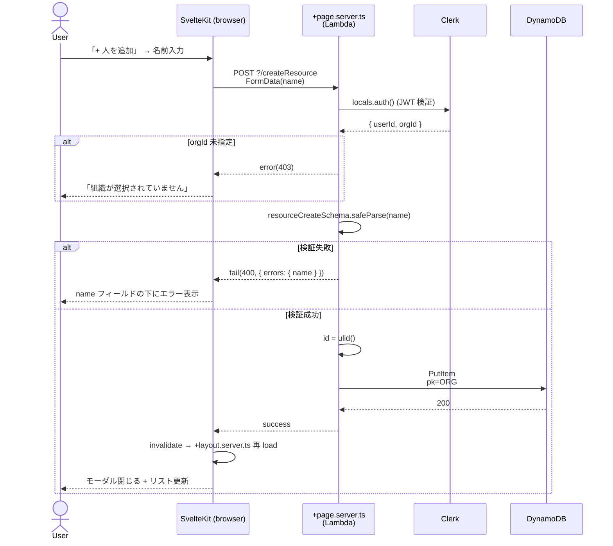
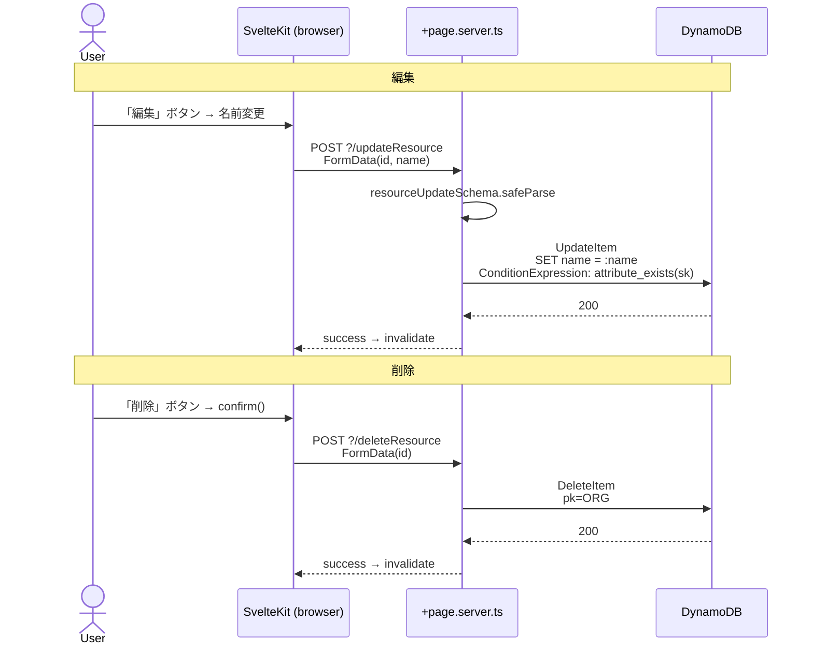
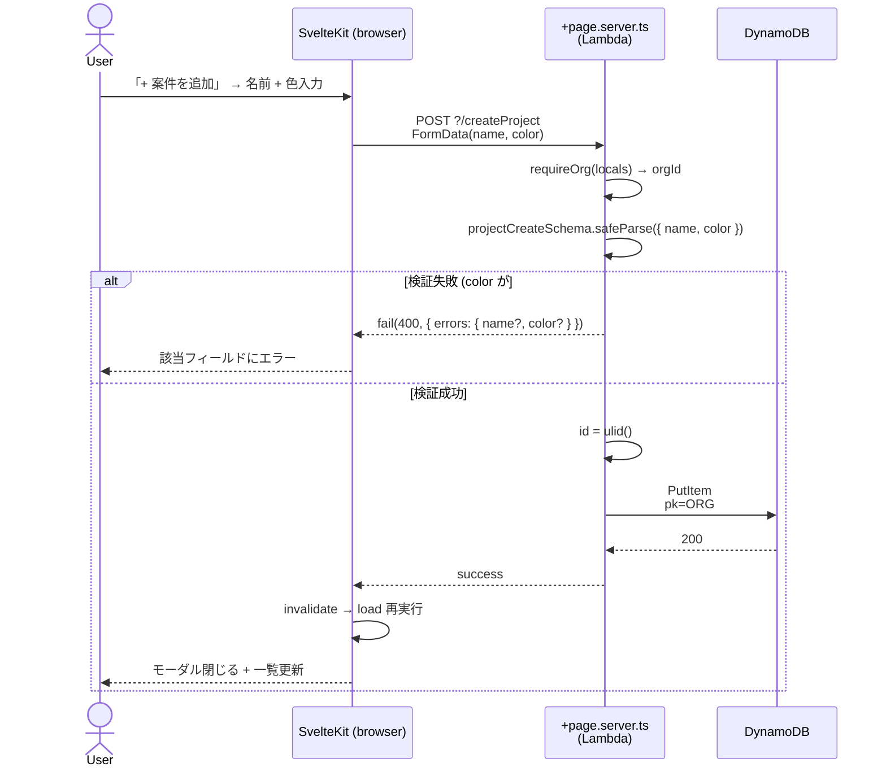

# Use Cases

resource-planner の主要ユースケースを **Mermaid sequence diagram** で記述する。
SvelteKit form actions / `+page.server.ts` load の動的振る舞い (画面 → action → DB → redirect/render) を「設計仕様」として残す場所。

## 書き方

各ユースケースは:

1. **見出し**: `## UC-NN: 短い動詞句` (例: `## UC-01: アサインを作成する`)
2. **概要**: 1-2 文
3. **アクター / 前提条件**: 誰が / どんな状態で発火するか
4. **対応コード**: 該当する `+page.server.ts` / form action / load 関数へのリンク (実装後に追記)
5. **Mermaid sequence**: 動作フロー
6. **エラーケース**: 失敗パスを箇条書き

## 一覧

| # | Use case | 状態 |
|---|---|---|
| UC-01 | [リソース (人) を追加・編集・削除する](#uc-01-リソース-人-を追加編集削除する) | 実装済 (PR-C) |
| UC-02 | [案件 (Project) を追加・編集・削除する](#uc-02-案件-project-を追加編集削除する) | 実装済 (PR-D) |
| UC-03 | [アサインを作成する](#uc-03-アサインを作成する) | 実装済 (PR-E) |

> CRUD 実装の進捗に応じて UC を追記する運用 ([#31](https://github.com/tommykey-apps/resource-planner/issues/31), [`docs/adr/0001-typescript-types-as-api-spec.md`](adr/0001-typescript-types-as-api-spec.md) 参照)。

---

## UC-01: リソース (人) を追加・編集・削除する

### 概要

組織内のメンバー (Resource) を管理する。タイムラインの行に対応する人を CRUD する。

### アクター / 前提条件

- アクター: 認証済みユーザー (`@genech.co.jp` ドメイン制限を通過、Clerk Org 必須 ON)
- 前提条件:
  - サインイン済 (Clerk session 有効、`event.locals.auth().orgId` 存在)
  - 「人を管理」モーダルから操作

### 対応コード

- 画面: [`web/src/routes/+page.svelte`](../web/src/routes/+page.svelte) (`<ResourceManager />` 配置)
- UI コンポーネント: [`web/src/lib/components/ResourceManager.svelte`](../web/src/lib/components/ResourceManager.svelte)
- Form actions: [`web/src/routes/+page.server.ts`](../web/src/routes/+page.server.ts) の `actions.createResource` / `updateResource` / `deleteResource`
- 検証 schema: [`web/src/lib/schemas/index.ts`](../web/src/lib/schemas/index.ts) の `resourceCreateSchema` / `resourceUpdateSchema`
- DB アクセス: [`web/src/lib/repository/resource.ts`](../web/src/lib/repository/resource.ts)

### Mermaid sequence (作成フロー)



### Mermaid sequence (編集 / 削除フロー)



### エラーケース

- **未認証 / Org 未指定**: `requireOrg(locals)` が `error(401|403)` で SvelteKit の `+error.svelte` に誘導 (UI polish は Orphan PR)
- **入力検証失敗**: `name` 未入力 / 100 文字超 → `fail(400, { errors })` で UI に表示、モーダル閉じない
- **DB 楽観的衝突**: ULID は実質衝突しないが、`attribute_not_exists(sk)` ConditionExpression が万一の二重 put を防ぐ
- **削除時の関連 Assignment**: 現状は **orphan として残る** (cascade delete は PR-H 予定)。UI の confirm ダイアログでその旨を注記

### 既知の制約 (PR-C 時点)

- 並べ替え / 一括選択 UI なし
- 検索フィルタなし
- delete は orphan を作る (PR-H で TransactWriteItems による cascade に置き換え予定)

---

## UC-02: 案件 (Project) を追加・編集・削除する

### 概要

案件 (タイムラインで帯の **色とラベル** に対応する Project) を組織内で管理する。
帯の表示色をユーザーが選べるようにする。

### アクター / 前提条件

- アクター: 認証済みユーザー (Clerk Org 必須 ON)
- 前提条件:
  - サインイン済 + `event.locals.auth().orgId` 存在
  - 「案件を管理」モーダルから操作

### 対応コード

- 画面: [`web/src/routes/+page.svelte`](../web/src/routes/+page.svelte) (`<ProjectManager />` 配置)
- UI コンポーネント: [`web/src/lib/components/ProjectManager.svelte`](../web/src/lib/components/ProjectManager.svelte)
- Form actions: [`web/src/routes/+page.server.ts`](../web/src/routes/+page.server.ts) の `actions.createProject` / `updateProject` / `deleteProject`
- 検証 schema: [`web/src/lib/schemas/index.ts`](../web/src/lib/schemas/index.ts) の `projectCreateSchema` / `projectUpdateSchema`
- DB アクセス: [`web/src/lib/repository/project.ts`](../web/src/lib/repository/project.ts)

### Mermaid sequence (作成フロー)



### Mermaid sequence (編集 / 削除)

UC-01 と同形 (UpdateItem / DeleteItem)。差分は更新対象が `name` + `color` の 2 フィールドである点のみ。
詳細は [UC-01 の編集 / 削除フロー](#mermaid-sequence-編集--削除フロー) を参照。

### エラーケース

- 未認証 / Org 未指定: UC-01 と同じ (`requireOrg` で 401/403)
- 入力検証失敗:
  - `name` 未入力 / 100 文字超 → `errors.name`
  - `color` が `#RRGGBB` 形式でない → `errors.color` (`<input type="color">` を使うので通常起きない)
- 削除時の関連 Assignment: 現状は orphan 残留 (PR-H で cascade)

### 既知の制約 (PR-D 時点)

- 色のプリセットパレットなし (ネイティブ `<input type="color">` のみ)
- 並べ替えなし
- delete は orphan (PR-H で改善)

---

## UC-03: アサインを作成する

### 概要

人 (Resource) を案件 (Project) に **期間 `[startDate, endDateExclusive)` の半開区間** でアサインする。
タイムラインに帯として表示される。フォーム UX は inclusive (「終了日 5/31」と入力)、内部は exclusive ([ADR 0004](adr/0004-end-date-exclusive-with-form-transform.md))。

### アクター / 前提条件

- アクター: 認証済みユーザー (Clerk Org 必須 ON)
- 前提条件:
  - 組織内に Resource ≥ 1、Project ≥ 1 (両方必要)
  - 「+ アサインを追加」ボタンから操作 (条件未達なら disable)

### 対応コード

- 画面: [`web/src/routes/+page.svelte`](../web/src/routes/+page.svelte) (`<AssignmentCreator />` 配置)
- UI コンポーネント: [`web/src/lib/components/AssignmentCreator.svelte`](../web/src/lib/components/AssignmentCreator.svelte)
- Form action: [`web/src/routes/+page.server.ts`](../web/src/routes/+page.server.ts) の `actions.createAssignment`
- 検証 schema: [`web/src/lib/schemas/index.ts`](../web/src/lib/schemas/index.ts) の `assignmentCreateSchema` (`refine` で `startDate <= endDate`、`.transform()` で `endDateExclusive = addDays(endDate, 1)`)
- DB アクセス: [`web/src/lib/repository/assignment.ts`](../web/src/lib/repository/assignment.ts)

### Mermaid sequence


### endDate の取り扱い (ADR 0004)

業界標準 (RFC 5545 / Google Calendar / PostgreSQL daterange / Java / Rust / Python / Bryntum) と整合する **「内部 exclusive 半開区間 + フォーム inclusive UX + Zod transform で 1 箇所変換」** 構成:

- **フォーム入力**: ユーザーは「終了日 (含む) 5/31」と入力 (UX inclusive)
- **Zod `.transform()`**: `endDateExclusive = addDays(input.endDate, 1)` で `2026-06-01` に変換 (**唯一の `+1` 変換場所**)
- **DB / API / Repository / Type**: `endDateExclusive: "2026-06-01"` で統一
- **ResourceTimeline 渡し**: 規約一致 (両者 exclusive) のため adapter は型変換のみ、`±1 day` 不要
- **帯のラベルと色**: `Project.name` / `Project.color` から compose (Resource のみ knows、Project は app 層で結合)

### エラーケース

- **未認証 / Org 未指定**: `requireOrg(locals)` が `error(401|403)`
- **resourceId / projectId が空 or 不正**: `errors.resourceId` / `errors.projectId` を表示
- **startDate > endDate**: Zod `refine` が「終了日は開始日以降にしてください」を返す (transform 前の inclusive 比較)
- **resource / project が同時刻に削除されていた**: FK 制約は無いため Put は成功する。タイムライン表示時に projectId が見つからず帯のラベル / 色がフォールバックする (UI で警告は出さない、PR-H で削除フローを cascade 化したらこのケースも消える)
- **SK 衝突**: ULID 衝突は実質ゼロ。`attribute_not_exists(sk)` ConditionExpression が万一のときに防御

### 既知の制約 (PR-E 時点)

- ResourceTimeline のセルクリック / 範囲ドラッグでの作成は未対応 (ライブラリ側の API 不在)。「+ アサインを追加」ボタン経由のフォーム入力のみ
- アサイン編集は未実装 (PR-F でドラッグ移動 / リサイズ、PR-G で削除)
- 重複期間チェックなし (1 人が同期間に複数案件にアサインされるのを許容)

---

## ユースケース追加のテンプレ

新規ユースケース追加時のコピペ用:

```markdown
## UC-NN: <短い動詞句>

### 概要
1-2 文。

### アクター / 前提条件
- アクター:
- 前提条件:

### 対応コード
- 画面:
- Action / Loader:
- 検証 schema:
- DB アクセス:

### Mermaid sequence
\`\`\`mermaid
sequenceDiagram
    actor User
    participant SK as SvelteKit (browser)
    participant Server
    participant DDB as DynamoDB
    User->>SK: ...
    SK->>Server: ...
\`\`\`

### エラーケース
- ...
```
